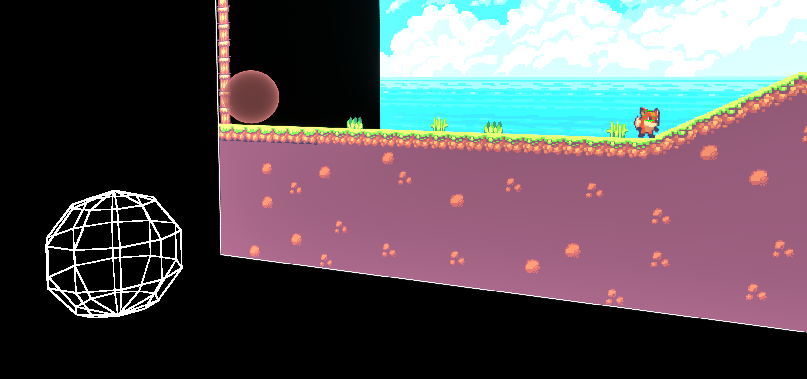
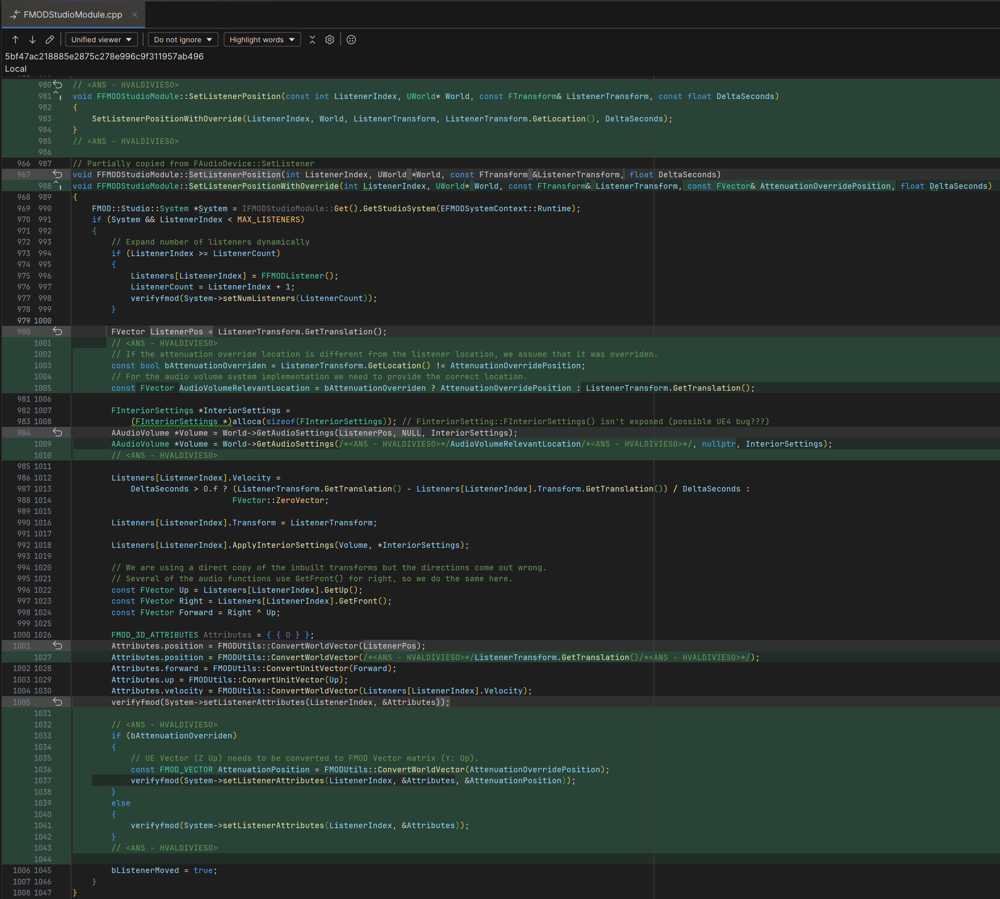
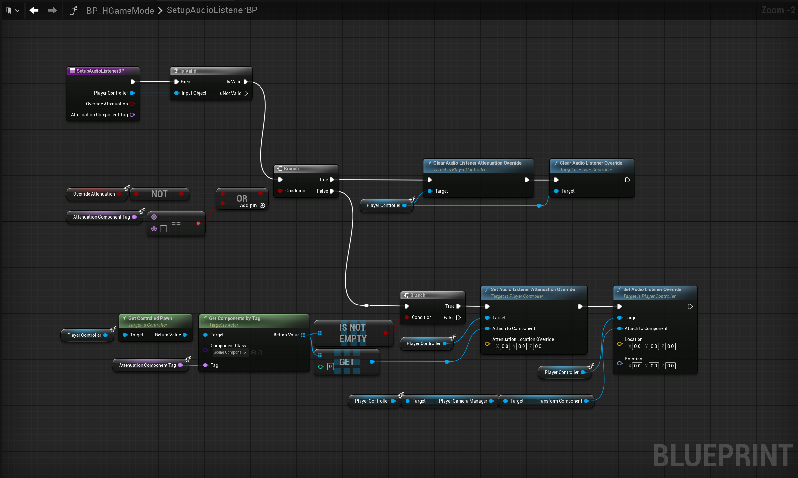

# Setting up the 3D Audio Listener in Unreal Engine and FMOD
### Game Audio Blog - Above Noise Studios 
English: [https://abovenoisestudios.com/blogeng/fmodue5listenereng](https://abovenoisestudios.com/blogeng/fmodue5listenereng)\
Spanish: [https://abovenoisestudios.com/blogespanol/fmodue5listeneresp](https://abovenoisestudios.com/blogespanol/fmodue5listeneresp)\
\
Created By: Horacio Valdivieso\
[horacio@abovenoisestudios.com](mailto:horacio@abovenoisestudios.com)\
[LinkedIn](https://www.linkedin.com/in/horaciovaldivieso/)

---
_Unreal Engine Version: **5.5.4**_\
_FMOD Version: **2.03.06**_
### **English:**
This repository contains an Unreal Engine 5 project, an FMOD studio project, and FMOD for Unreal plugin integration.
It uses different templates created with the Epic Games Launcher plus a Paper2D template created by [Cobra Code](https://github.com/CobraCodeDev/TP_2DSideScrollerBP).
This project aims to show how setup a 3D audio listener in FMOD and program it using Blueprints and C++.

**How to Use?:**\
To download this project, click on the **Code** button and **Download Zip**.
To rebuild and compile the project, ensure you have [Visual Studio](https://visualstudio.microsoft.com/) for Windows or [Xcode](https://download.developer.apple.com/Developer_Tools/Xcode_13.4.1/Xcode_13.4.1.xip) for Mac.
Right-click on **AuListenerUEFMOD.uproject** and choose **"Generate Visual Studio Project Files"** on Windows or **Services > "Generate Xcode project"** on Mac.
Double-click on **AuListenerUEFMOD.uproject** to open the UE5 project.

**Rebuild the project:**

The FMOD Studio project is inside the **AuListenerUEFMOD_Project** folder.

**About Compiler Versions:**

WINDOWS:

- _Visual Studio 2019 v16.11.5 to 2022 are currently compatible with UE5_.
- _Its essential to install these Workloads: **".NET Desktop Development"**, **"Desktop Development With C++"**, and **"Game Development With C++"**._\
  **Here is a useful video on how to set up VS for UE5 Development:** [LINK](https://youtu.be/8xJRr6Yr_LU?t=105)

MAC:
- _Xcode v12.4 to 13.4.1 are currently compatible with UE5_.

Enjoy!

### **Spanish:**
Este repositorio contiene un proyecto en Unreal Engine 5, un proyecto de FMOD studio, y la integración del plugin FMOD para Unreal.
Usa varias maquetas creadas con el Epic Games Launcher además de una maqueta Paper2D creada por [Cobra Code](https://github.com/CobraCodeDev/TP_2DSideScrollerBP).
Este proyecto pretende mostrar como configurar un 3D audio listener en FMOD y cómo programarlo usando Blueprints y C++. 

**Cómo Usar?:**\
Para descargar este proyecto, da click en el botón **Code** y luego en **Download Zip**.
Para construir y compilar el proyecto, asegúrate de tener [Visual Studio](https://visualstudio.microsoft.com/) para Windows o [Xcode](https://download.developer.apple.com/Developer_Tools/Xcode_13.4.1/Xcode_13.4.1.xip).
Haz click derecho en **AuListenerUEFMOD.uproject** y selecciona **"Generate Visual Studio Project Files"** en Windows o **Services > "Generate Xcode project"** en Mac.
Haz doble click en **AuListenerUEFMOD.uproject** para abrir el proyecto UE5.

**Reconstruye el proyecto:**

El proyecto FMOD Studio se encuentra en la carpeta **AuListenerUEFMOD_Project**.

**Sobre las versiones del compilador:**

WINDOWS:

- _Visual Studio 2019 v16.11.5 a la 2022 son actualmente compatibles con UE5_.
- _Es esencial instalar estas cargas de trabajo: **".NET Para El Escritorio"**, **"Desarrollo Para El Escritorio Con C++"**, y **"Desarrolo De Juegos Con C++"**._\
**Aquí hay un vídeo muy útil sobre cómo configurar VS para desarrollo en UE5:** [LINK](https://youtu.be/8xJRr6Yr_LU?t=105)

MAC:

- _Xcode v12.4 a la 13.4.1 son actualmente compatibles con UE5_.

Disfruta!

## Viewport

## C++ Implementation

## Blueprint Implementation

